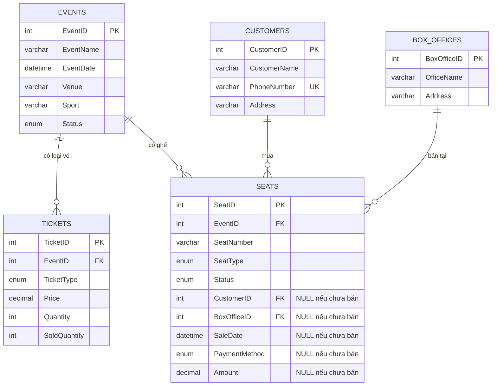

# ER Diagram - Sports Ticketing (5 bảng)

## Sơ đồ thực thể - quan hệ

## Đặc điểm thiết kế

Mô hình tuân thủ chặt chẽ yêu cầu **5 bảng** của đề bài. Vì không có bảng giao dịch riêng (`TicketSales`/`Orders`), bảng **`Seats` kiêm hai vai trò**:

- **Catalog ghế**: định danh mỗi ghế của mỗi sự kiện (`EventID`, `SeatNumber`, `SeatType`)
- **Bản ghi bán vé**: khi ghế được bán, các cột `CustomerID`, `BoxOfficeID`, `SaleDate`, `PaymentMethod`, `Amount` được điền vào và `Status` chuyển sang `Sold`.

## Cardinalities

| Quan hệ | Bậc | Diễn giải |
|---|---|---|
| Events → Tickets | 1:N | Mỗi sự kiện có nhiều loại vé (VIP/Standard/Economy/Student) |
| Events → Seats | 1:N | Mỗi sự kiện có nhiều ghế |
| Customers → Seats | 1:N | Mỗi khách có thể mua nhiều ghế (nullable - ghế chưa bán không có khách) |
| BoxOffices → Seats | 1:N | Mỗi phòng vé bán nhiều ghế (nullable) |

## Ràng buộc

### PK & FK
| Bảng | PK | FK |
|---|---|---|
| Events | EventID | — |
| Tickets | TicketID | EventID → Events |
| Customers | CustomerID | — |
| BoxOffices | BoxOfficeID | — |
| Seats | SeatID | EventID → Events, CustomerID → Customers (NULL OK), BoxOfficeID → BoxOffices (NULL OK) |

### UNIQUE
- `Customers.PhoneNumber`
- `Tickets(EventID, TicketType)` - một loại vé / một sự kiện
- `Seats(EventID, SeatNumber)` - không trùng số ghế trong cùng sự kiện

### CHECK
- `Tickets.Price >= 0`, `SoldQuantity <= Quantity`
- `Seats.Amount >= 0` (khi không NULL)
- `Customers.PhoneNumber` ≥ 9 ký tự
- **Sold-complete**: khi `Status='Sold'`, tất cả `CustomerID/BoxOfficeID/SaleDate/PaymentMethod/Amount` phải NOT NULL

### Triggers
- `trg_before_seat_insert`: ghế chỉ tạo được nếu `Tickets` đã có giá cho cặp (Event, SeatType)
- `trg_before_seat_update`: chặn bán vé khi sự kiện hủy / đã diễn ra / hết vé
- `trg_after_seat_update`: tự động sync `Tickets.SoldQuantity` (+1 khi bán, -1 khi hủy)
- `trg_before_seat_delete`: cấm xóa ghế đã bán
- `trg_after_event_update`: khi sự kiện hủy → tự động chuyển tất cả ghế Sold → Cancelled

## Đánh đổi so với mô hình 6+ bảng

| Khía cạnh | 5 bảng (mô hình hiện tại) | 6+ bảng (có TicketSales) |
|---|---|---|
| Số bảng | ✅ Đúng đề bài | Vượt đề bài |
| Lưu lịch sử bán | ⚠️ Mất khi resell | ✅ Đầy đủ |
| Một khách mua nhiều ghế 1 lần | ⚠️ Phải UPDATE nhiều dòng | ✅ 1 Order, N OrderDetails |
| Snapshot giá tại thời điểm mua | ✅ Có (cột Amount) | ✅ Có |
| Phức tạp triển khai | Đơn giản hơn | Phức tạp hơn |
| Audit log | ⚠️ Không có | Có thể thêm |

## Xuất sơ đồ từ MySQL Workbench

1. **Database** → **Reverse Engineer**
2. Chọn connection → Next → chọn schema `sports_ticketing`
3. Workbench tự dựng EER Diagram
4. **File** → **Export** → **PNG/PDF** để chèn vào báo cáo
